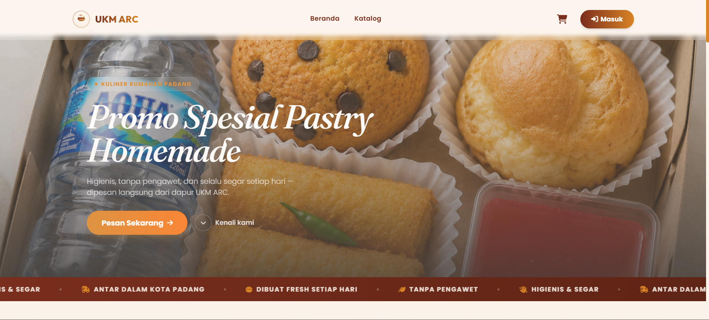
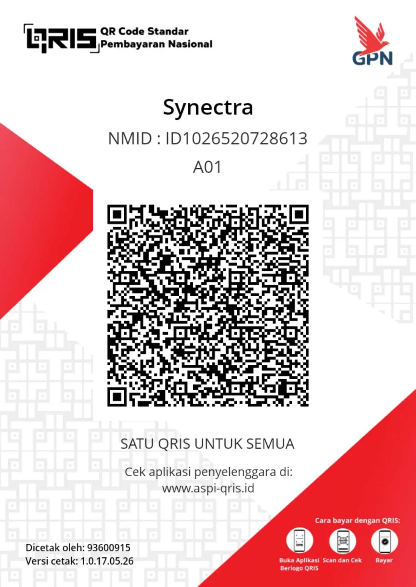

# Sistem Informasi E-Commerce Dapoer ARC (UKM ARC)



Website e-commerce premium single-vendor untuk UKM kuliner **Dapoer ARC** (Padang, Sumatera Barat) — dibangun menggunakan arsitektur bersih **PHP Native (MVC)**, **MySQL**, dan **Tailwind CSS (CDN)** dengan sentuhan desain modern *Glassmorphism*.

---

## 📸 Antarmuka Baru yang Premium & Interaktif
Aplikasi ini telah diperbarui secara menyeluruh untuk memberikan kesan visual yang menggugah selera (*appetizing*):
* **Hero Banner Full-Screen**: Slider beranda yang menyatu di belakang navigasi kaca transparan (*frosted glass navbar*).
* **Grid Bento Produk Terlaris**: Menampilkan 5 produk unggulan terlaris dalam tata letak Bento Grid yang dinamis (1 produk utama besar dan 4 produk pendamping).
* **Kartu Kategori Kustom**: Grid 4 kolom di desktop dan horizontal swipe di mobile, lengkap dengan tema warna pastel, deskripsi unik, dan animasi hover 3D.
* **Informasi Kontak Terstruktur**: Informasi alamat, telepon, dan jam buka dibingkai dalam kartu putih estetik dengan efek hover serta transisi animasi AOS staggered.
* **Peta Minimalis Terintegrasi**: Peta lokasi tersemat rapi dalam bingkai kartu (`border-4 border-white shadow-lg rounded-[2rem]`) dengan atribusi OpenStreetMap yang tersembunyi secara rapi via *CSS crop masking* untuk tampilan premium yang bersih.

---

## 🛠️ Cara Menjalankan (Laragon)

1. Pastikan folder ini berada di `C:\laragon\www\e-commerce` dan Apache + MySQL Laragon aktif.
2. Import skema database:
   ```bash
   mysql -u root < database/schema.sql
   ```
3. Isi data awal (semua kategori, produk asli Dapoer ARC, admin, testimoni, banner, dan settings):
   ```bash
   php database/seed.php
   ```
   > **Catatan Seeding**: Script seeding secara otomatis akan menghapus data lama secara aman sebelum memasukkan data baru sehingga database selalu bersih dan sinkron dengan berkas gambar di `uploads/products/`.

4. Akses via vhost auto-Laragon: `http://e-commerce.test/`

   > Aplikasi ini didesain untuk diakses dari **document root vhost** (bukan sebagai subfolder `localhost/e-commerce/`), karena router mencocokkan path bersih dari `REQUEST_URI`.

---

## 👥 Akun Default

| Role | Email | Password |
|---|---|---|
| Admin | admin@ukmarc.test | admin123 |
| Customer Contoh | customer@example.test | customer123 |

---

## 📂 Struktur Proyek

```
app/
  controllers/     Controller utama & sub-folder admin/ (namespace App\Controllers)
  models/          Model data database (namespace App\Models)
  views/           Tampilan per modul (landing, auth, products, cart, checkout, orders, admin)
  core/            Core framework (Router, Database, Controller, Model dasar, helpers)
public/
  index.php        Front controller (single entry point)
  uploads.php      Proxy serving file dari uploads/ (di luar public/)
  assets/          CSS/JS/gambar statis (termasuk logo.svg, QR.jpeg, & about_us.png)
uploads/           Berkas gambar produk & bukti bayar (terproteksi .htaccess di luar public/)
database/          schema.sql + seed.php (Seeder produk asli Dapoer ARC)
config/config.php  Konfigurasi database, BASE_URL, timezone
```

---

## 🔒 Fitur Keamanan
* **Anti SQL Injection**: Semua query database memanfaatkan PDO Prepared Statements.
* **Hashing Password**: Menggunakan algoritma enkripsi standard industri `password_hash()`.
* **Proteksi CSRF**: Token CSRF diintegrasikan ke seluruh form pengubahan data.
* **Secure Image Serving**: Berkas gambar diunggah di luar folder publik (`uploads/`) dan disajikan menggunakan file proxy `public/uploads.php` setelah divalidasi tipe MIME (via `fileinfo`).

---

## 📄 Lisensi (Synectra License)
Proyek ini didistribusikan di bawah **Lisensi Synectra (Synectra Public License)**. Anda diperbolehkan menggunakan, memodifikasi, dan mendistribusikan kode ini untuk tujuan komersial maupun non-komersial selama mencantumkan hak cipta asli dari Synectra.

*Copyright (c) 2026 Synectra. Hak Cipta Dilindungi Undang-Undang.*

---

## 💖 Dukungan & Donasi
Jika Anda menyukai proyek ini dan ingin memberikan dukungan untuk pengembangan lebih lanjut, Anda dapat memindai kode QR dukungan di bawah ini:



*Terima kasih atas dukungan Anda terhadap kelangsungan proyek Dapoer ARC!*
