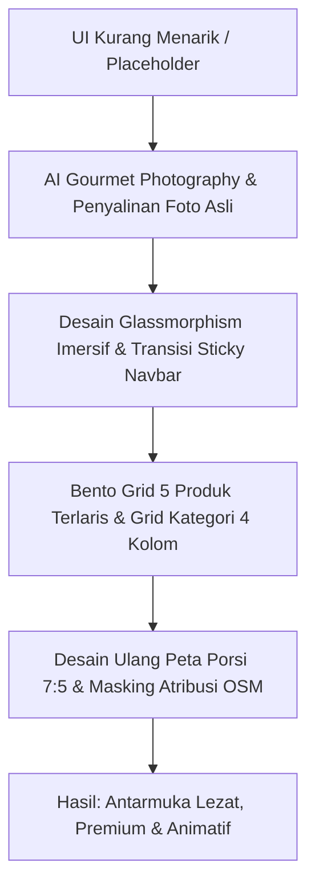

# Studi Kasus: Transformasi Estetika Visual E-Commerce Dapoer ARC

Studi kasus ini mendokumentasikan evolusi desain antarmuka e-commerce **Dapoer ARC** (UKM ARC) dari sebuah template e-commerce sederhana menjadi platform belanja kuliner premium, interaktif, dan modern.

---

## 1. Latar Belakang Masalah

Sebelum dilakukan pembaruan, website e-commerce UKM ARC memiliki beberapa kendala estetika yang serius yang mengurangi daya tarik jual produk kuliner (*unappetizing UI*):

* **Gambar Produk Kosong (Placeholder)**: Database hanya berisi referensi kosong, sehingga produk-produk andalan seperti Croissant, Bolu Gulung, dan Rendang hanya menampilkan icon lingkaran/garis SVG bawaan template yang kaku.
* **Hero Banner Kurang Menarik**: Slider promosi atas terasa terputus dari navigasi, tidak memenuhi layar, dan memakai gambar tiruan yang kurang relevan.
* **Layout Kategori Terpotong**: Baris kategori menggunakan horizontal scroll tanpa grid, sehingga pada desktop beberapa kartu tampak terpotong di tepi kanan secara tidak rapi.
* **Ikon Kategori Hilang**: Icon kategori "Makanan Berat" pecah/tidak muncul karena memanggil icon FontAwesome Pro berbayar (`soup`), sementara website memakai FontAwesome versi Free.
* **Bagian Peta Tidak Proporsional**: Peta lokasi OpenStreetMap terbentang sangat lebar secara tidak seimbang, mepet ke bagian footer tanpa pemisah, serta memuat teks atribusi lisensi yang menumpuk di atas visual peta.

---

## 2. Solusi Desain & Langkah Eksekusi

Guna meningkatkan nafsu makan pelanggan saat berkunjung (*appetite appeal*), kami melakukan transformasi desain berprinsip **"Rich Aesthetics & Interactive Motion"**:

### Langkah Arah Visual:

### Detail Pembaruan:
1. **Integrasi Foto Kuliner Asli**:
   Mengganti seluruh gambar dummy dengan foto kuliner asli Dapoer ARC yang menggugah selera (seperti Brownies Panggang, Nasi Ayam Bakar, Ikan Cabe Ijo Pete, Klepon, dan Risol). Kami juga menggunakan foto-foto ini sebagai latar belakang *Hero Banner* utama.
2. **Glassmorphism Imersif**:
   Menjadikan Hero Banner penuh layar (`h-screen`) dan memposisikannya di bawah header. Navigasi utama disulap menjadi kaca transparan melayang (`backdrop-blur-sm bg-white/20`) yang akan menyusut secara dinamis saat digulirkan.
3. **Penyusunan Ulang Grid Bento & Kategori**:
   * Membatasi item terlaris menjadi **5 produk saja** agar membentuk Bento Grid yang simetris (1 besar di kiri, 4 kecil di kanan).
   * Merubah baris kategori menjadi **Grid 4 kolom di desktop** (sehingga tidak ada kartu terpotong lagi) dan tetap berupa baris geser ramah sentuhan di handphone.
4. **Peta Minimalis Berbingkai & Masking Atribusi**:
   * Membagi rasio kolom kontak & peta menjadi **7:5** (memperkecil peta sebesar 30% untuk keseimbangan proporsi).
   * Memasukkan peta ke dalam bingkai kartu putih tebal berbayangan (`border-4 shadow-lg rounded-[2rem]`).
   * Menyembunyikan baris atribusi OpenStreetMap dengan menaikkan tinggi iframe `+40px` dan memberikan margin bawah `-40px` di dalam container `overflow-hidden`.
   * Menghilangkan margin negatif akhir agar peta memiliki pemisah yang bernapas sebelum footer gelap dimulai.

---

## 3. Hasil & Dampak Visual

Melalui serangkaian transformasi visual ini, Dapoer ARC kini memiliki identitas online yang sangat kuat, mewah, dan profesional. Transisi animasi mikro (AOS staggered entry, hover rotation, soft shadow glows) membuat interaksi belanja terasa responsif dan hidup.

---

## 📄 Lisensi (Synectra License)
Analisis dan desain dalam dokumen studi kasus ini dilindungi di bawah **Lisensi Synectra**. 

*Copyright (c) 2026 Synectra. Hak Cipta Dilindungi.*

---

## 💖 Dukungan Pengembang
Bantu kami untuk terus berinovasi dan menghadirkan solusi digital berkualitas bagi UKM Indonesia dengan memindai QR code dukungan berikut:

